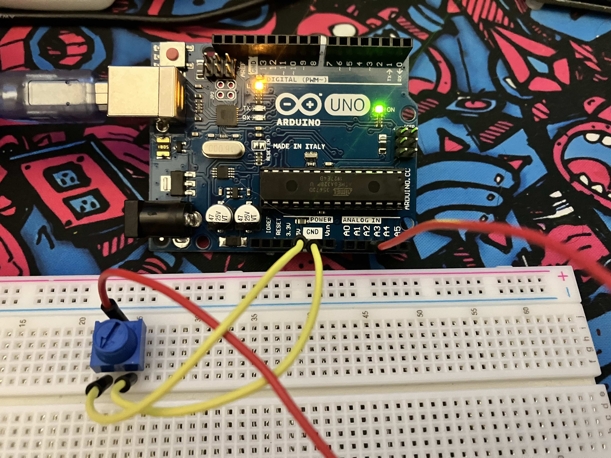

# Arduino to Node.js

This repository contains the code needed to control browser elements using an Arduino and pieces from a basic electronics kit.

## Technology needed

### Hardware
- Arduino Uno
- Potentiometer
- Breadboard
- 3 M-to-M jumper wires

### Software
- Node.js
- Arduino IDE

## Setup

### Arduino
1. Put the potentiometer on the breadboard
2. On the side of the potentiometer that has two pins, use the jumper wires to connect the left side to the `5V` pin and the right side to the `GND` pin. Ensure that their placement on the breadboard aligns with the pins on the potentiometer.
3. On the other side, connect the center pin of the potentiometer to an analog pin (this code uses port `A2`).
4. Connect the Arduino to your computer. When you're done, your breadboard and Arduino should look something like this: 
5. Open `src.ino` in the Arduino IDE and upload it to your Arduino.
6. Make note of the port that the Arduino is active on (something like `/dev/cu.blahblahblah`). You will need it for Node setup.

### Node
1. Create a `.env` file and set a variable `ARDUINO_PORT` to the port you noted in the last step above.
2. Run `npm install`.
3. Run `node app.js`.
4. You should see an HTML page served on `localhost:3000`.
5. Turn the potentiometer and notice the opacity of the red square change!